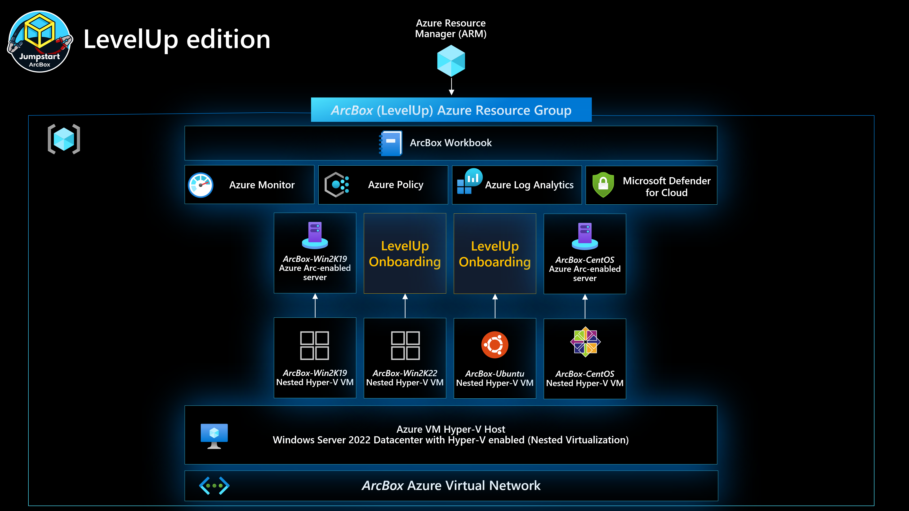

## Azure Arc-enabled servers LevelUp Training



The following README will guide you on how to automatically deploy an ArcBox for use with the Azure Arc-enabled servers LevelUp training.

Azure VMs are leveraging the [Azure Instance Metadata Service (IMDS)](https://docs.microsoft.com/en-us/azure/virtual-machines/windows/instance-metadata-service) by default. By projecting an Azure VM as an Azure Arc-enabled server, a "conflict" is created which will not allow for the Azure Arc server resources to be represented as one when the IMDS is being used and instead, the Azure Arc server will still "act" as a native Azure VM.

However, **for demo purposes only**, the below guide will allow you to use and onboard VMs running on an Azure VM to Azure Arc and by doing so, you will be able to simulate a server which is deployed outside of Azure (i.e "on-premises" or in other cloud platforms)

> **Note: It is not expected for an Azure VM to be projected as an Azure Arc-enabled server. The below scenario is unsupported and should ONLY be used for demo and testing purposes.**

## Prerequisites

* [Install or update Azure CLI to version 2.15.0 and above](https://docs.microsoft.com/en-us/cli/azure/install-azure-cli?view=azure-cli-latest). Use the below command to check your current installed version.

  ```shell
  az --version
  ```

* Create Azure service principal (SP).

    To be able to complete the scenario and its related automation, Azure service principal assigned with the “Contributor” role on the subscription is required. To create it, login to your Azure account run the below command (this can also be done in [Azure Cloud Shell](https://shell.azure.com/)).

    ```shell
    az login
    az account set --subscription "<Subscription Id>"
    az ad sp create-for-rbac -n "<Unique SP Name>" --role contributor
    ```

    For example:

    ```shell
    az ad sp create-for-rbac -n "http://AzureArcLevelUp" --role contributor
    ```

    Output should look like this:

    ```json
    {
        "appId": "XXXXXXXXXXXXXXXXXXXXXXXXXXXX",
        "displayName": "AzureArcLevelUp",
        "name": "http://AzureArcLevelUp",
        "password": "XXXXXXXXXXXXXXXXXXXXXXXXXXXX",
        "tenant": "XXXXXXXXXXXXXXXXXXXXXXXXXXXX"
    }
    ```

    > **Note: It is optional, but highly recommended, to scope the SP to a specific [Azure subscription](https://docs.microsoft.com/en-us/cli/azure/ad/sp?view=azure-cli-latest).**

## Deploy the Template from the Azure Portal

1. Click the button below to deploy the LevelUp ArcBox template via the Azure Portal:

    [](https://portal.azure.com/#create/Microsoft.Template/uri/https%3A%2F%2Fraw.githubusercontent.com%2Fmicrosoft%2Fazure_arc%2Farc-levelup-deploy%2Fazure_arc_servers_jumpstart%2Flevelup%2Farm%2Fazuredeploy.json/createUIDefinitionUri/https%3A%2F%2Fraw.githubusercontent.com%2Fmicrosoft%2Fazure_arc%2Farc-levelup-deploy%2Fazure_arc_servers_jumpstart%2Flevelup%2Farm%2FcreateUiDefinition.json)

2. Provide the required parameters, and deploy the template:

    

    > **Note: Please make sure that the GitHub account and branch match the field highlighted in red.**

## Post Deployment Notes

The nested VM's that are deployed onto the Hyper-V have the following default login credentials:

  * Windows Server (2019/2022)
    * Username: `Administrator`
    * Password: `ArcDemo123!!`
  * Linux (Ubuntu/CentOS)
    * Username: `arcdemo`
    * Password: `ArcDemo123!!`
